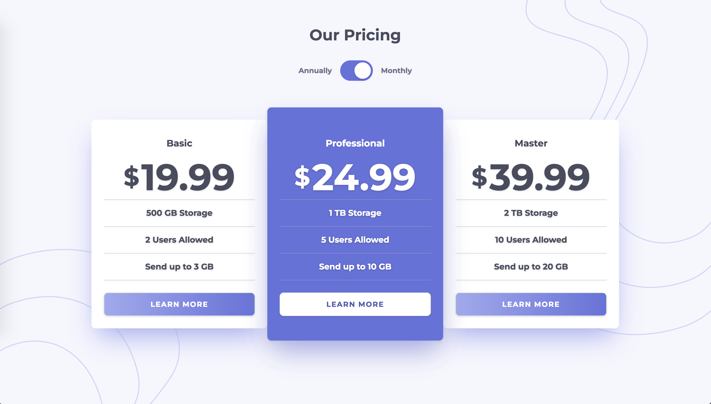
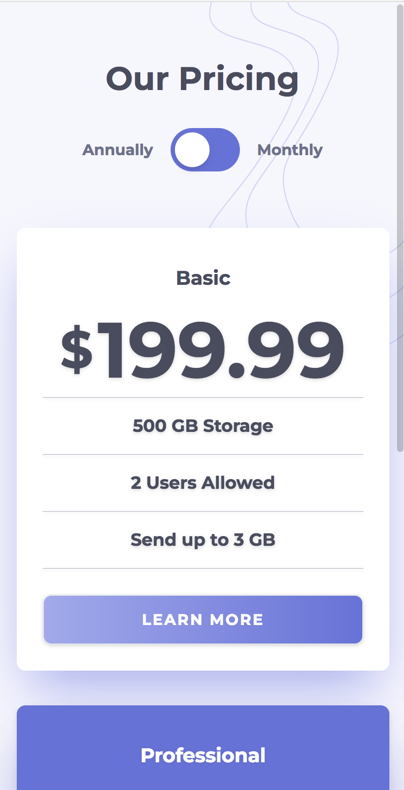

# Pricing - Next.js

## Screenshots
<div>
  <h3>Desktop</h3>
  
</div>
<br/>
<div>
  <h3>Mobile</h3>
  
</div>

## Getting Started

First, run the development server:

```bash
npm run dev
# or
yarn dev
```

Open [http://localhost:3000](http://localhost:3000) with your browser to see the result.

## Built with

- [Next.js](https://github.com/vercel/next.js/) - React based framework with server-side rendering
- [create-next-app](https://github.com/vercel/next.js/tree/canary/packages/create-next-app) - CLI tool for Next.js
- [Tailwind CSS](https://github.com/tailwindlabs/tailwindcss) - Utility-first CSS framework
- [styled-components](https://github.com/styled-components/styled-components) - CSS-in-JS framework
- ["Build a CSS only toggle switch using TailwindCSS" by Jamie Carter](https://medium.com/front-end-weekly/build-a-css-only-toggle-switch-using-tailwindcss-d2739882934) - Toggle switch
- [Frontend Mentor - Pricing component with toggle](https://github.com/frontendmentorio/pricing-component-with-toggle)- App design, background images
